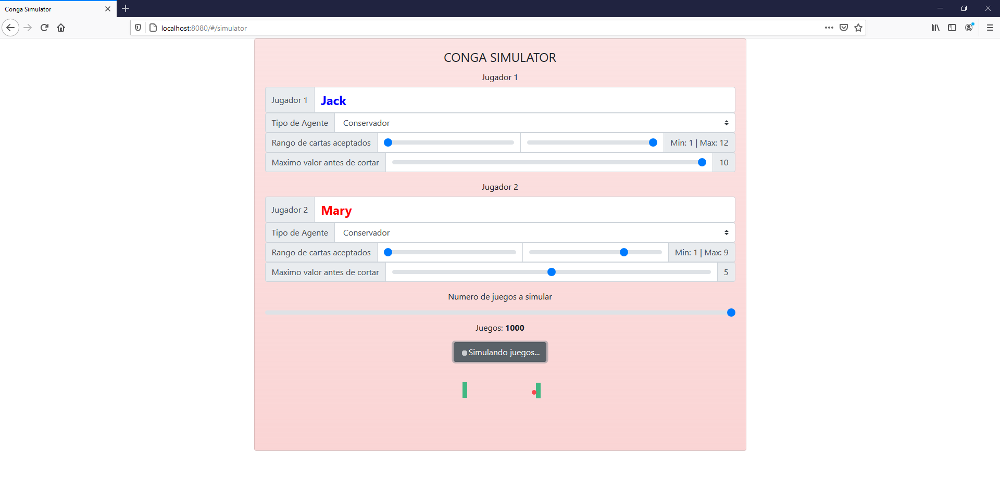
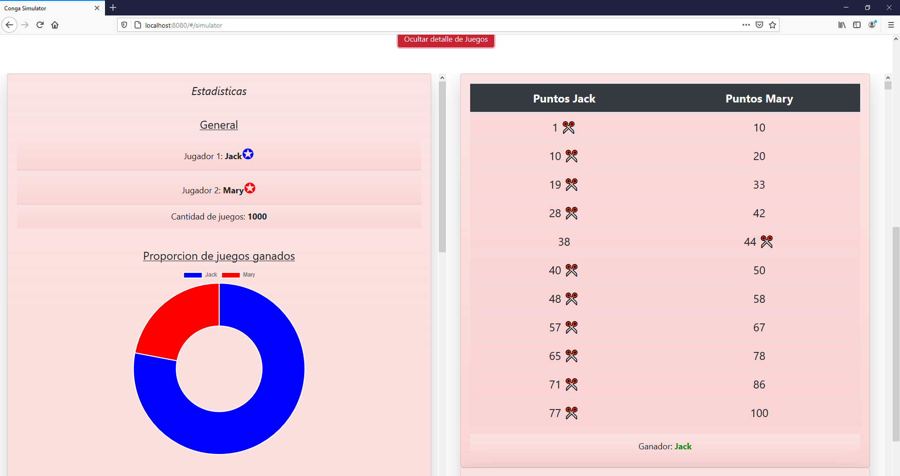
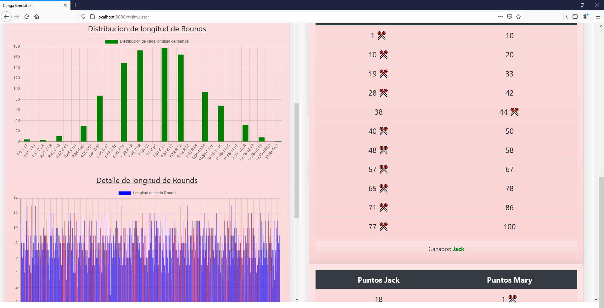
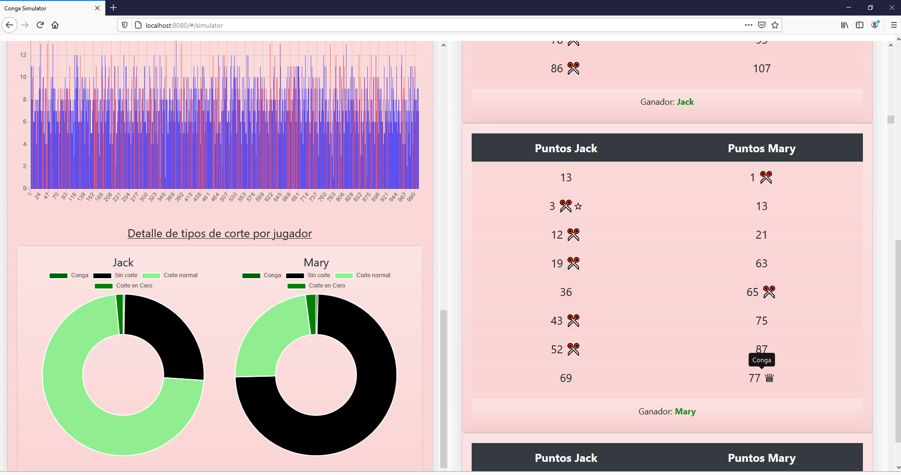

# conga-simulator

This projects will experiment around the idea of:
- Building a *Conga Card* Game engine
- Creating game agents that execute strategies
- Simulating thousands of games in order to asses strategies' effectiveness
- Training agents to learn the best strategy possible
- Building a Web App experience with side features (Games logs, various statistics)
- Building a Web UI to manage most workflows

## How to run it

### Pre-requisites

You need to have docker installed, as main app environment is based on docker containers

## Run it

1. `cd` into project root directory
1. run `docker-compose up --build`
1. REST API is now running on `http://localhost:5000`
1. Web Interface is now running on `http://localhost:8080`
1. Go visit through the Web UI and start simulating games!

## Simulation form

The app currently lets you simulate Conga games played by bots. You can setup your simulation using this form
 
 #### Important concepts

 In order to structure the simulation, we make use of the following concepts:

 - **Round**: Set of game moves until some player "cuts"
 - **Game**: Set of *rounds* until some player reaches 100 points or someone plays a *Conga move*

 ## Games statistics and details

After a simulation is complete, we show you plenty of statistics (still developing more) about the overall simulation (left) and details about each game (right).
Details include the result of each round, alongside info of who cut, and what type of cut it was (normal, zero or Conga)